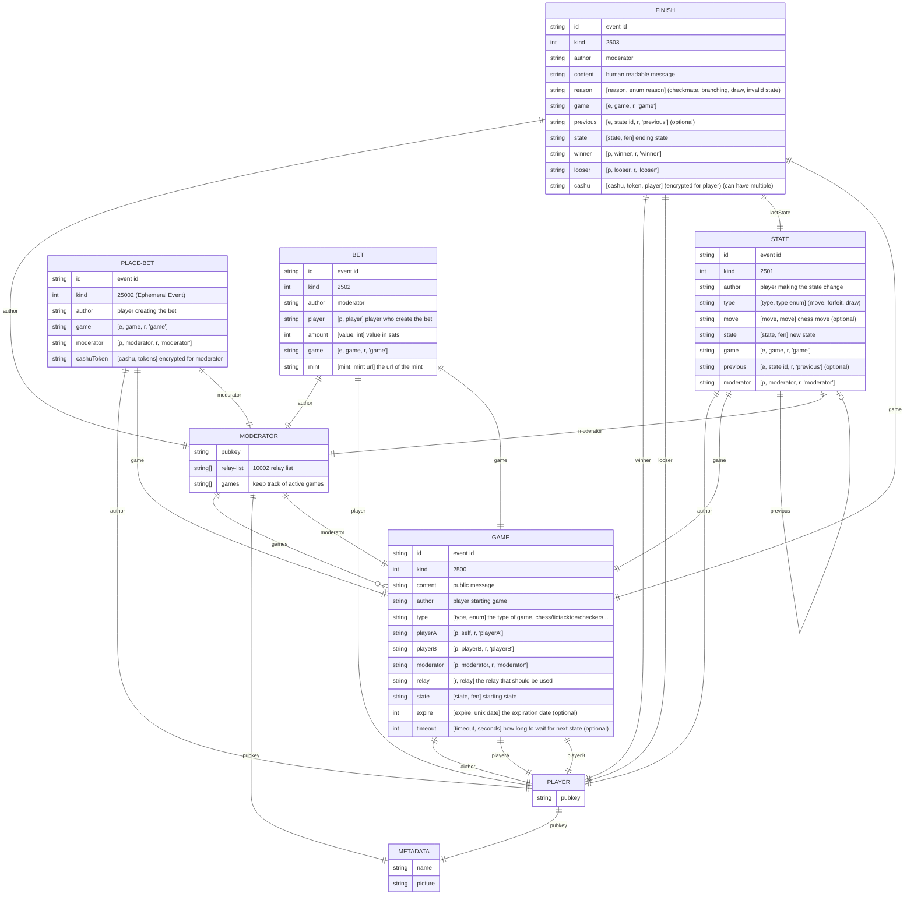
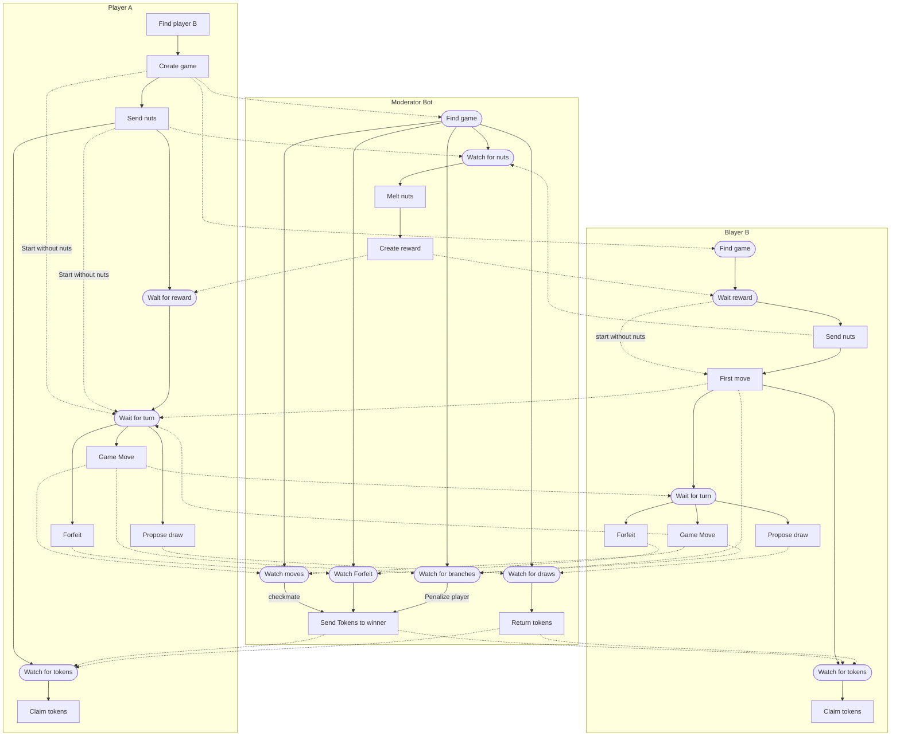

# ChessNut

Chess over [nostr](https://github.com/nostr-protocol/nostr) where players can post rewards using [cashu](https://github.com/cashubtc) tokens (nuts)

# This is project isn't working yet, don't pay any lightning invoices (you will loose your hard earned sats)

## Nostr Events

## Game Flow

