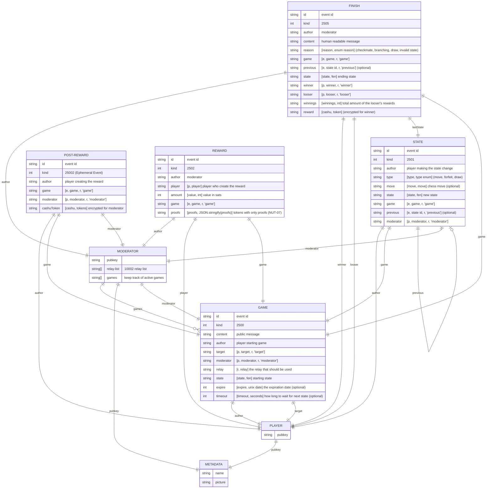
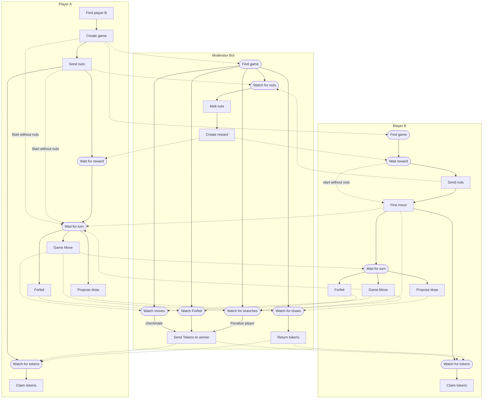

# ChessNut

Chess over [nostr](https://github.com/nostr-protocol/nostr) where players can post rewards using [cachu](https://github.com/cashubtc) tokens (nuts)

## Nostr Events

```mermaid
erDiagram
    METADATA {
        string name
        string picture
    }
    PLAYER {
        string pubkey
    }
    PLAYER ||--|| METADATA : pubkey

    MODERATOR {
        string pubkey
        string[] relay-list "10002 relay list"
        string[] games "keep track of active games"
    }
    MODERATOR ||--o{ GAME : games
    MODERATOR ||--|| METADATA : pubkey

    GAME {
        string id "event id"
        int kind "2500"
        string content "public message"
        string author "player starting game"
        string target "[p, target, r, 'target']"
        string moderator "[p, moderator, r, 'moderator']"
        string relay "[r, relay] the relay that should be used"
        string state "[state, fen] starting state"
        int expire "[expire, unix date] the expiration date (optional)"
        int timeout "[timeout, seconds] how long to wait for next state (optional)"
    }
    GAME ||--|| PLAYER : author
    GAME ||--|| PLAYER : target
    GAME ||--|| MODERATOR : moderator

    STATE {
        string id "event id"
        int kind "2501"
        string author "player making the state change"
        string type "[type, type enum] (move, forfeit, draw)"
        string move "[move, move] chess move (optional)"
        string state "[state, fen] new state"
        string game "[e, game, r, 'game']"
        string previous "[e, state id, r, 'previous'] (optional)"
        string moderator "[p, moderator, r, 'moderator']"
    }
    STATE ||--|| PLAYER : author
    STATE ||--|| GAME : game
    STATE ||--o| STATE : previous
    STATE ||--|| MODERATOR : moderator

    POST-REWARD {
        string id "event id"
        int kind "25002 (Ephemeral Event)"
        string author "player creating the reward"
        string game "[e, game, r, 'game']"
        string moderator "[p, moderator, r, 'moderator']"
        string cashuToken "[cashu, tokens] encrypted for moderator"
    }
    POST-REWARD ||--|| PLAYER : author
    POST-REWARD ||--|| GAME : game
    POST-REWARD ||--|| MODERATOR : moderator

    REWARD {
        string id "event id"
        int kind "2502"
        string author "moderator"
        string player "[p, player] player who create the reward"
        int amount "[value, int] value in sats"
        string game "[e, game, r, 'game']"
        string proofs "[proofs, JSON.stringify(proofs)] tokens with only proofs (NUT-07)"
    }
    REWARD ||--|| MODERATOR : author
    REWARD ||--|| PLAYER : player
    REWARD ||--|| GAME : game

    FINISH {
        string id "event id"
        int kind "2505"
        string author "moderator"
        string content "human readable message"
        string reason "[reason, enum reason] (checkmate, branching, draw, invalid state)"
        string game "[e, game, r, 'game']"
        string previous "[e, state id, r, 'previous'] (optional)"
        string state "[state, fen] ending state"
        string winner "[p, winner, r, 'winner']"
        string looser "[p, looser, r, 'looser']"
        string winnings "[winnings, int] total amount of the looser's rewards"
        string reward "[cashu, token] (encrypted for winner)"
    }
    FINISH ||--|| MODERATOR : author
    FINISH ||--|| PLAYER : winner
    FINISH ||--|| PLAYER : looser
    FINISH ||--|| STATE : lastState
    FINISH ||--|| GAME : game
```

## Game Flow

```mermaid
flowchart TD
    subgraph Player A
    afindPlayer[Find player B]-->aCreateGame[Create game]
    aCreateGame-->aSendNuts[Send nuts]
    aCreateGame-.Start without nuts.->aWaitForTurn
    aSendNuts--> aWaitForNuts([Wait for reward])
    aSendNuts-.Start without nuts.->aWaitForTurn
    aWaitForNuts-->aWaitForTurn([Wait for turn])
    aWaitForTurn-->aGameMove[Game Move]
    aWaitForTurn-->aForfeit[Forfeit]
    aWaitForTurn-->aProposeDraw[Propose draw]
    aSendNuts-->aWatchTokens([Watch for tokens])
    aWatchTokens-->aClaimTokens[Claim tokens]
    end

    subgraph Moderator Bot
    modFindGame([Find game])-->modWatchForNuts([Watch for nuts])
    modWatchForNuts-->modConsumeNut[Melt nuts]
    modConsumeNut-->modCreateReward[Create reward]
    modFindGame-->modWatchMove([Watch moves])
    modFindGame-->modWatchForfeit([Watch Forfeit])
    modFindGame-->modWatchForDraw([Watch for draws])
    modFindGame-->modWatchForBranches([Watch for branches])
    modWatchMove--checkmate-->modSendTokens[Send Tokens to winner]
    modWatchForfeit-->modSendTokens
    modWatchForDraw-->modReturnTokens[Return tokens]
    modWatchForBranches--Penalize player-->modSendTokens
    end

    subgraph Blayer B
    bLookForGames([Find game])-->bWaitForNuts([Wait reward])
    bWaitForNuts-.start without nuts.->bFirstMove
    bWaitForNuts-->bSendNuts[Send nuts]
    bSendNuts-->bFirstMove[First move]
    bFirstMove-->bWaitForTurn([Wait for turn])
    bFirstMove-->bWatchTokens([Watch for tokens])
    bWaitForTurn --> bGameMove[Game Move]
    bWaitForTurn-->bForfeit[Forfeit]
    bWaitForTurn-->bProposeDraw[Propose draw]
    bWatchTokens-->bClaimTokens[Claim tokens]
    end

    aSendNuts-.->modWatchForNuts
    bSendNuts-.->modWatchForNuts
    bFirstMove-.->aWaitForTurn
    modCreateReward-.->bWaitForNuts
    modCreateReward-.->aWaitForNuts
    aCreateGame-.->bLookForGames
    aCreateGame-.->modFindGame
    aGameMove-.->bWaitForTurn
    bGameMove-.->aWaitForTurn
    aGameMove-.->modWatchMove
    bGameMove-.->modWatchMove
    aForfeit-.->modWatchForfeit
    bForfeit-.->modWatchForfeit
    modSendTokens-.->aWatchTokens
    modSendTokens-.->bWatchTokens
    aProposeDraw-.->modWatchForDraw
    bProposeDraw-.->modWatchForDraw
    modReturnTokens-.->aWatchTokens
    modReturnTokens-.->bWatchTokens
    bFirstMove-.->modWatchForBranches
    bGameMove-.->modWatchForBranches
    aGameMove-.->modWatchForBranches
```
