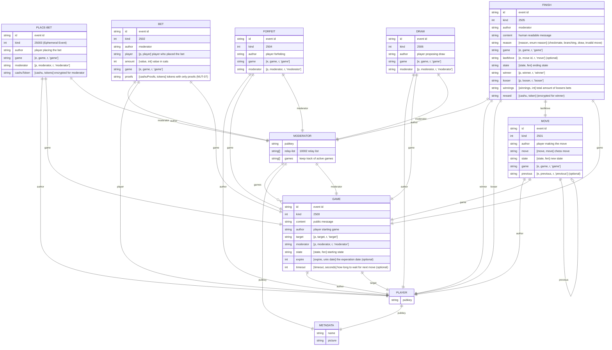
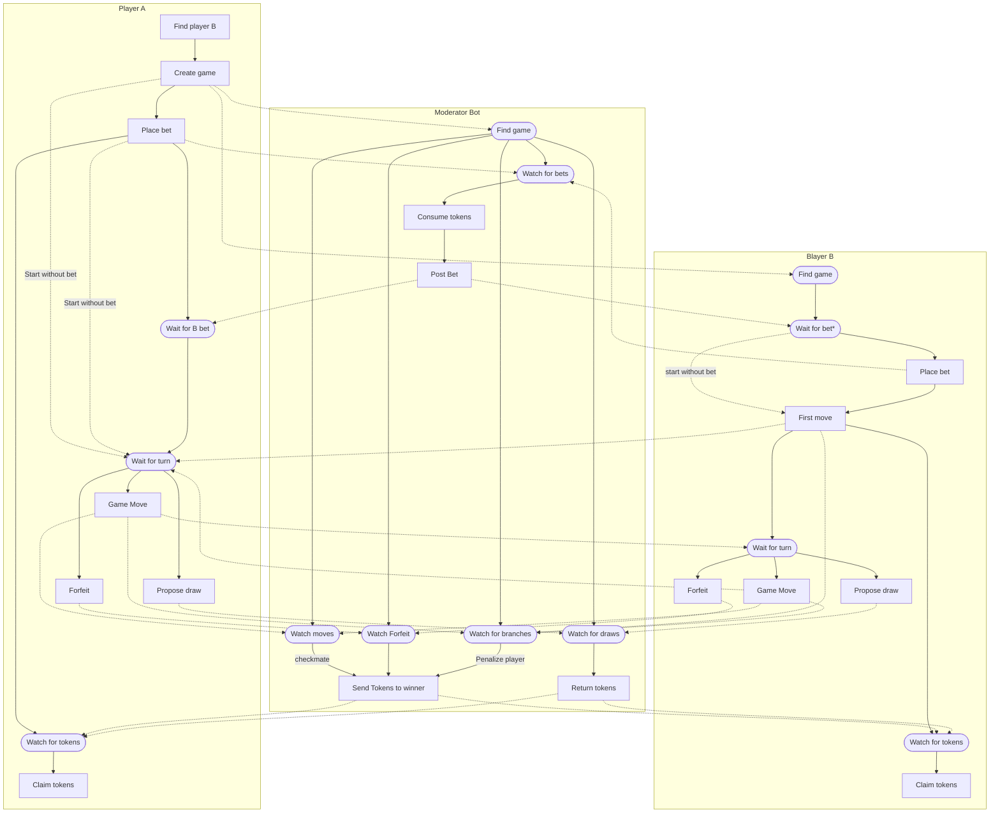

# ChessNuts

A [nostr](https://github.com/nostr-protocol/nostr) based chess game that uses [cachu](https://github.com/cashubtc) to place bets

## Nostr Events

```mermaid
erDiagram
    METADATA {
        string name
        string picture
    }
    PLAYER {
        string pubkey
    }
    PLAYER ||--|| METADATA : pubkey

    MODERATOR {
        string pubkey
        string[] relay-list "10002 relay list"
        string[] games "keep track of active games"
    }
    MODERATOR ||--o{ GAME : games
    MODERATOR ||--|| METADATA : pubkey

    GAME {
        string id "event id"
        int kind "2500"
        string content "public message"
        string author "player starting game"
        string target "[p, target, r, 'target']"
        string moderator "[p, moderator, r, 'moderator']"
        string state "[state, fen] starting state"
        int expire "[expire, unix date] the experation date (optional)"
        int timeout "[timeout, seconds] how long to wait for next move (optional)"
    }
    GAME ||--|| PLAYER : author
    GAME ||--|| PLAYER : target
    GAME ||--|| MODERATOR : moderator

    PLACE-BET {
        string id "event id"
        int kind "25003 (Ephemeral Event)"
        string author "player placing the bet"
        string game "[e, game, r, 'game']"
        string moderator "[p, moderator, r, 'moderator']"
        string cashuToken "[cashu, tokens] encrypted for moderator"
    }
    PLACE-BET ||--|| PLAYER : author
    PLACE-BET ||--|| GAME : game
    PLACE-BET ||--|| MODERATOR : moderator

    BET {
        string id "event id"
        int kind "2502"
        string author "moderator"
        string player "[p, player] player who placed the bet"
        int amount "[value, int] value in sats"
        string game "[e, game, r, 'game']"
        string proofs "[cashuProofs, tokens] tokens with only proofs (NUT-07)"
    }
    BET ||--|| MODERATOR : author
    BET ||--|| PLAYER : player
    BET ||--|| GAME : game

    MOVE {
        string id "event id"
        int kind "2501"
        string author "player making the move"
        string move "[move, move] chess move"
        string state "[state, fen] new state"
        string game "[e, game, r, 'game']"
        string previous "[e, previous, r, 'previous'] (optional)"
    }
    MOVE ||--|| PLAYER : author
    MOVE ||--|| GAME : game
    MOVE ||--o| MOVE : previous

    FORFEIT {
        string id "event id"
        int kind "2504"
        string author "player forfeiting"
        string game "[e, game, r, 'game']"
        string moderator "[p, moderator, r, 'moderator']"
    }
    FORFEIT ||--|| PLAYER : author
    FORFEIT ||--|| GAME : game
    FORFEIT ||--|| MODERATOR : moderator

    DRAW {
        string id "event id"
        int kind "2506"
        string author "player proposing draw"
        string game "[e, game, r, 'game']"
        string moderator "[p, moderator, r, 'moderator']"
    }
    DRAW ||--|| PLAYER : author
    DRAW ||--|| GAME : game
    DRAW ||--|| MODERATOR : moderator

    FINISH {
        string id "event id"
        int kind "2505"
        string author "moderator"
        string content "human readable message"
        string reason "[reason, enum reason] (checkmate, branching, draw, invalid move)"
        string game "[e, game, r, 'game']"
        string lastMove "[e, move id, r, 'move'] (optional)"
        string state "[state, fen] ending state"
        string winner "[p, winner, r, 'winner']"
        string looser "[p, looser, r, 'looser']"
        string winnings "[winnings, int] total amount of loosers bets"
        string reward "[cashu, token] (encrypted for winner)"
    }
    FINISH ||--|| MODERATOR : author
    FINISH ||--|| PLAYER : winner
    FINISH ||--|| PLAYER : looser
    FINISH ||--|| MOVE : lastMove
    FINISH ||--|| GAME : game
```

## Game Flow

```mermaid
flowchart TD
    subgraph Player A
    afindPlayer[Find player B]-->aCreateGame[Create game]
    aCreateGame-->aPlaceBet[Place bet]
    aCreateGame-.Start without bet.->aWaitForTurn
    aPlaceBet--> aWaitForBet([Wait for B bet])
    aPlaceBet-.Start without bet.->aWaitForTurn
    aWaitForBet-->aWaitForTurn([Wait for turn])
    aWaitForTurn-->aGameMove[Game Move]
    aWaitForTurn-->aForfeit[Forfeit]
    aWaitForTurn-->aProposeDraw[Propose draw]
    aPlaceBet-->aWatchTokens([Watch for tokens])
    aWatchTokens-->aClaimTokens[Claim tokens]
    end

    subgraph Moderator Bot
    modFindGame([Find game])-->modWatchForBets([Watch for bets])
    modWatchForBets-->modConsumeToken[Consume tokens]
    modConsumeToken-->modPostBet[Post Bet]
    modFindGame-->modWatchMove([Watch moves])
    modFindGame-->modWatchForfeit([Watch Forfeit])
    modFindGame-->modWatchForDraw([Watch for draws])
    modFindGame-->modWatchForBranches([Watch for branches])
    modWatchMove--checkmate-->modSendTokens[Send Tokens to winner]
    modWatchForfeit-->modSendTokens
    modWatchForDraw-->modReturnTokens[Return tokens]
    modWatchForBranches--Penalize player-->modSendTokens
    end

    subgraph Blayer B
    bLookForGames([Find game])-->bWaitForBet([Wait for bet*])
    bWaitForBet-.start without bet.->bFirstMove
    bWaitForBet-->bPlaceBet[Place bet]
    bPlaceBet-->bFirstMove[First move]
    bFirstMove-->bWaitForTurn([Wait for turn])
    bFirstMove-->bWatchTokens([Watch for tokens])
    bWaitForTurn --> bGameMove[Game Move]
    bWaitForTurn-->bForfeit[Forfeit]
    bWaitForTurn-->bProposeDraw[Propose draw]
    bWatchTokens-->bClaimTokens[Claim tokens]
    end

    aPlaceBet-.->modWatchForBets
    bPlaceBet-.->modWatchForBets
    bFirstMove-.->aWaitForTurn
    modPostBet-.->bWaitForBet
    modPostBet-.->aWaitForBet
    aCreateGame-.->bLookForGames
    aCreateGame-.->modFindGame
    aGameMove-.->bWaitForTurn
    bGameMove-.->aWaitForTurn
    aGameMove-.->modWatchMove
    bGameMove-.->modWatchMove
    aForfeit-.->modWatchForfeit
    bForfeit-.->modWatchForfeit
    modSendTokens-.->aWatchTokens
    modSendTokens-.->bWatchTokens
    aProposeDraw-.->modWatchForDraw
    bProposeDraw-.->modWatchForDraw
    modReturnTokens-.->aWatchTokens
    modReturnTokens-.->bWatchTokens
    bFirstMove-.->modWatchForBranches
    bGameMove-.->modWatchForBranches
    aGameMove-.->modWatchForBranches
```
