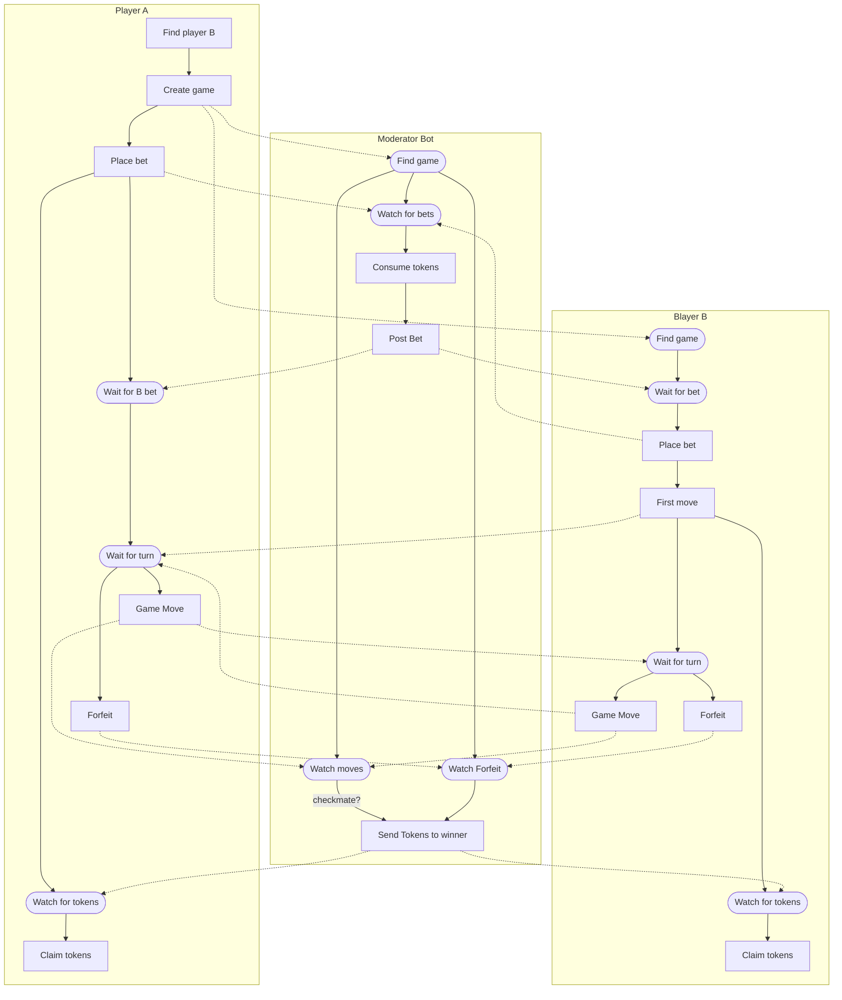

```mermaid
flowchart TD
    subgraph Player A
    afindPlayer[Find player B]-->aCreateGame[Create game]

    aCreateGame-->aPlaceBet[Place bet]
    aPlaceBet--> aWaitForBet([Wait for B bet])
    aWaitForBet --> aWaitForTurn([Wait for turn])
    aWaitForTurn --> aGameMove[Game Move]
    aWaitForTurn-->aForfeit[Forfeit]
    aPlaceBet-->aWatchTokens([Watch for tokens])
    aWatchTokens-->aClaimTokens[Claim tokens]
    end

    subgraph Moderator Bot
    modFindGame([Find game]) --> modWatchForBets([Watch for bets])
    modWatchForBets-->modConsumeToken[Consume tokens]
    modConsumeToken-->modPostBet[Post Bet]
    modFindGame --> modWatchMove([Watch moves])
    modFindGame --> modWatchForfeit([Watch Forfeit])
    modWatchMove-- checkmate? -->modSendTokens[Send Tokens to winner]
    modWatchForfeit-->modSendTokens
    end

    subgraph Blayer B
    bLookForGames([Find game]) --> bWaitForBet([Wait for bet])
    bWaitForBet --> bPlaceBet[Place bet]
    bPlaceBet --> bFirstMove[First move]
    bFirstMove -.-> aWaitForTurn
    bFirstMove --> bWaitForTurn([Wait for turn])
    bFirstMove-->bWatchTokens([Watch for tokens])
    bWaitForTurn --> bGameMove[Game Move]
    bWaitForTurn-->bForfeit[Forfeit]
    bWatchTokens-->bClaimTokens[Claim tokens]
    end

    aPlaceBet-.->modWatchForBets
    bPlaceBet-.->modWatchForBets
    modPostBet-.->bWaitForBet
    modPostBet-.->aWaitForBet
    aCreateGame-.->bLookForGames
    aCreateGame-.->modFindGame
    aGameMove-.->bWaitForTurn
    bGameMove-.->aWaitForTurn
    aGameMove-.->modWatchMove
    bGameMove-.->modWatchMove
    aForfeit-.->modWatchForfeit
    bForfeit-.->modWatchForfeit
    modSendTokens-.->aWatchTokens
    modSendTokens-.->bWatchTokens
```
