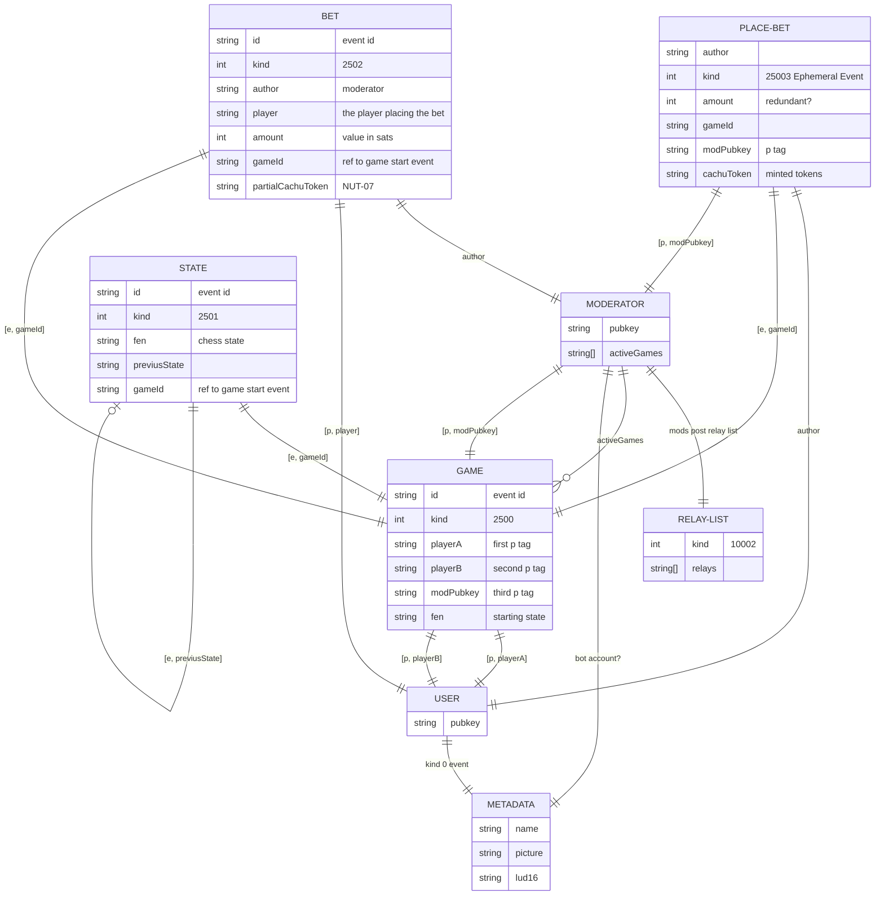

```mermaid
erDiagram
    METADATA {
        string name
        string picture
        string lud16
    }
    USER {
        string pubkey
    }
    USER ||--|| METADATA : "kind 0 event"

    RELAY-LIST {
        int kind "10002"
        string[] relays
    }

    MODERATOR {
        string pubkey
        string[] activeGames
    }
    MODERATOR ||--|| RELAY-LIST : "mods post relay list"
    MODERATOR ||--o{ GAME : "activeGames"
    MODERATOR ||--|| METADATA : "bot account?"

    PLACE-BET {
        string author
        int kind "25003 Ephemeral Event"
        int amount "redundant?"
        string gameId
        string modPubkey "p tag"
        string cachuToken "minted tokens"
    }
    PLACE-BET ||--|| USER : "author"
    PLACE-BET ||--|| GAME : "[e, gameId]"
    PLACE-BET ||--|| MODERATOR : "[p, modPubkey]"

    BET {
        string id "event id"
        int kind "2502"
        string author "moderator"
        string player "the player placing the bet"
        int amount "value in sats"
        string gameId "ref to game start event"
        string partialCachuToken "NUT-07"
    }
    BET ||--|| MODERATOR : "author"
    BET ||--|| USER : "[p, player]"
    BET ||--|| GAME : "[e, gameId]"

    GAME {
        string id "event id"
        int kind "2500"
        string playerA "first p tag"
        string playerB "second p tag"
        string modPubkey "third p tag"
        string fen "starting state"
    }
    GAME ||--|| USER : "[p, playerA]"
    GAME ||--|| USER : "[p, playerB]"
    GAME ||--|| MODERATOR : "[p, modPubkey]"

    STATE {
        string id "event id"
        int kind "2501"
        string fen "chess state"
        string previusState
        string gameId "ref to game start event"
    }
    STATE ||--|| GAME : "[e, gameId]"
    STATE ||--o| STATE : "[e, previusState]"
```
